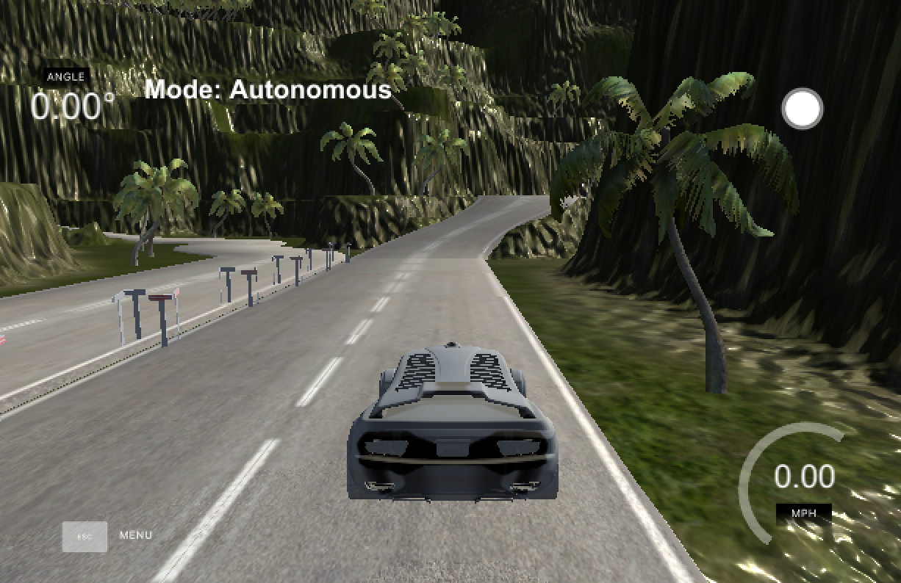
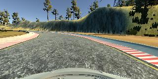

|Lake Track|Jungle Track|
|:--------:|:------------:|
|[](https://drive.google.com/file/d/1ri-SfsGBRmyQ67T4MZHOcmAo30cvA3Wl/view?usp=sharing)|[](https://drive.google.com/file/d/1SbfFG4Ga6TnadWolt6JyKqNe0eAlyVyN/view?usp=sharing)|

## Project Description

In this project, I use a neural network to clone car driving behavior.  It is a supervised regression problem between the car steering angles and the road images in front of a car.  

Those images were taken from three different camera angles (the center, the left and the right of the car).  

The network is based on [The NVIDIA model](https://devblogs.nvidia.com/parallelforall/deep-learning-self-driving-cars/), which has been proven to work in this problem domain.

As image processing is involved, the model is using convolutional layers for automated feature engineering.  

### Files included

- model.py The script used to create and train the model.
- drive.py The script to drive the car. You can feel free to resubmit the original drive.py or make modifications and submit your modified version.
- utils.py The script to provide useful functionalities (i.e. image preprocessing and augumentation)
- model.h5 The model weights.
- environments.yml conda environment (Use TensorFlow without GPU)
- environments-gpu.yml conda environment (Use TensorFlow with GPU)

Note: drive.py is originally from [the Udacity Behavioral Cloning project GitHub](https://github.com/udacity/CarND-Behavioral-Cloning-P3) but it has been modified to control the throttle.

## Quick Start

# Use TensorFlow with GPU
You can manually install the required libraries (see the contents of the requirement.txt files) using pip.

### Run the pretrained model

Start up [the Udacity self-driving simulator](https://github.com/udacity/self-driving-car-sim), choose a scene and press the Autonomous Mode button.  Then, run the model as follows:

```python
python drive.py model.h5
```

### To train the model
```python
python model.py
```

This will generate a file `model-<epoch>.h5` whenever the performance in the epoch is better than the previous best.  For example, the first epoch will generate a file called `model-000.h5`.

## Model Architecture Design

The design of the network is based on [the NVIDIA model](https://devblogs.nvidia.com/parallelforall/deep-learning-self-driving-cars/), which has been used by NVIDIA for the end-to-end self driving test.  As such, it is well suited for the project.  

It is a deep convolution network which works well with supervised image classification / regression problems.  As the NVIDIA model is well documented, I was able to focus how to adjust the training images to produce the best result with some adjustments to the model to avoid overfitting and adding non-linearity to improve the prediction.

I've added the following adjustments to the model. 

- I used Lambda layer to normalized input images to avoid saturation and make gradients work better.
- I've added an additional dropout layer to avoid overfitting after the convolution layers.
- I've also included ELU for activation function for every layer except for the output layer to introduce non-linearity.

In the end, the model looks like as follows:

- Image normalization
- Convolution: 5x5, filter: 24, strides: 2x2, activation: ELU
- Convolution: 5x5, filter: 36, strides: 2x2, activation: ELU
- Convolution: 5x5, filter: 48, strides: 2x2, activation: ELU
- Convolution: 3x3, filter: 64, strides: 1x1, activation: ELU
- Convolution: 3x3, filter: 64, strides: 1x1, activation: ELU
- Drop out (0.5)
- Fully connected: neurons: 100, activation: ELU
- Fully connected: neurons:  50, activation: ELU
- Fully connected: neurons:  10, activation: ELU
- Fully connected: neurons:   1 (output)

As per the NVIDIA model, the convolution layers are meant to handle feature engineering and the fully connected layer for predicting the steering angle.  However, as stated in the NVIDIA document, it is not clear where to draw such a clear distinction.  Overall, the model is very functional to clone the given steering behavior.  

The below is an model structure output from the Keras which gives more details on the shapes and the number of parameters.

| Layer (type)                   |Output Shape      |Params  |Connected to     |
|--------------------------------|------------------|-------:|-----------------|
|lambda_1 (Lambda)               |(None, 66, 200, 3)|0       |lambda_input_1   |
|convolution2d_1 (Convolution2D) |(None, 31, 98, 24)|1824    |lambda_1         |
|convolution2d_2 (Convolution2D) |(None, 14, 47, 36)|21636   |convolution2d_1  |
|convolution2d_3 (Convolution2D) |(None, 5, 22, 48) |43248   |convolution2d_2  |
|convolution2d_4 (Convolution2D) |(None, 3, 20, 64) |27712   |convolution2d_3  |
|convolution2d_5 (Convolution2D) |(None, 1, 18, 64) |36928   |convolution2d_4  |
|dropout_1 (Dropout)             |(None, 1, 18, 64) |0       |convolution2d_5  |
|flatten_1 (Flatten)             |(None, 1152)      |0       |dropout_1        |
|dense_1 (Dense)                 |(None, 100)       |115300  |flatten_1        |
|dense_2 (Dense)                 |(None, 50)        |5050    |dense_1          |
|dense_3 (Dense)                 |(None, 10)        |510     |dense_2          |
|dense_4 (Dense)                 |(None, 1)         |11      |dense_3          |
|                                |**Total params**  |252219  |                 |


## Data Preprocessing

### Image Sizing

- the images are cropped so that the model won’t be trained with the sky and the car front parts
- the images are resized to 66x200 (3 YUV channels) as per NVIDIA model
- the images are normalized (image data divided by 127.5 and subtracted 1.0).  As stated in the Model Architecture section, this is to avoid saturation and make gradients work better)


## Model Training

### Image Augumentation

For training, I used the following augumentation technique along with Python generator to generate unlimited number of images:

- Randomly choose right, left or center images.
- For left image, steering angle is adjusted by +0.2
- For right image, steering angle is adjusted by -0.2
- Randomly flip image left/right
- Randomly translate image horizontally with steering angle adjustment (0.002 per pixel shift)
- Randomly translate image virtically
- Randomly added shadows
- Randomly altering image brightness (lighter or darker)

Using the left/right images is useful to train the recovery driving scenario.  The horizontal translation is useful for difficult curve handling (i.e. the one after the bridge).


### Examples of Augmented Images

The following is the example transformations:

**Center Image**



**Left Image**


**Right Image**


## Training, Validation and Test

I splitted the images into train and validation set in order to measure the performance at every epoch.  Testing was done using the simulator.

As for training, 

- I used mean squared error (MSE) for the loss function to measure how close the model predicts to the given steering angle for each image.
- I used Adam optimizer
- I used ModelCheckpoint from Keras to save the model only if the validation loss is improved which is checked for every epoch.

## References
- NVIDIA model: https://devblogs.nvidia.com/parallelforall/deep-learning-self-driving-cars/
- Udacity Self-Driving Car Simulator: https://github.com/udacity/self-driving-car-sim
